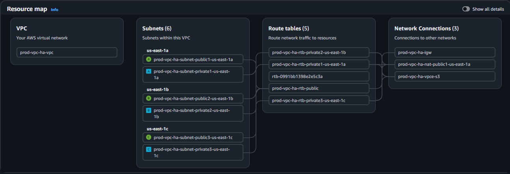
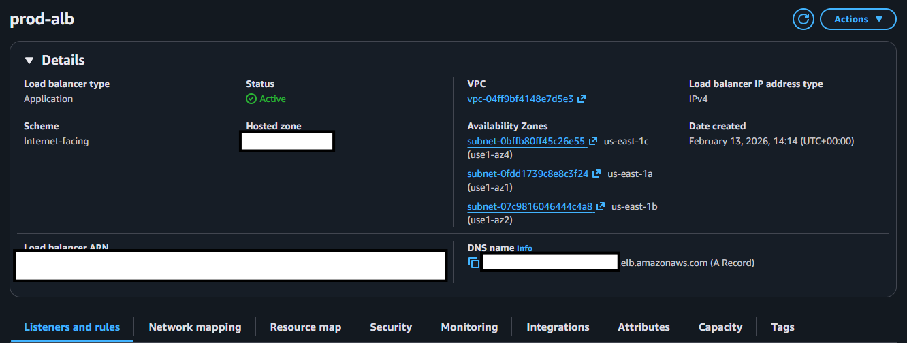
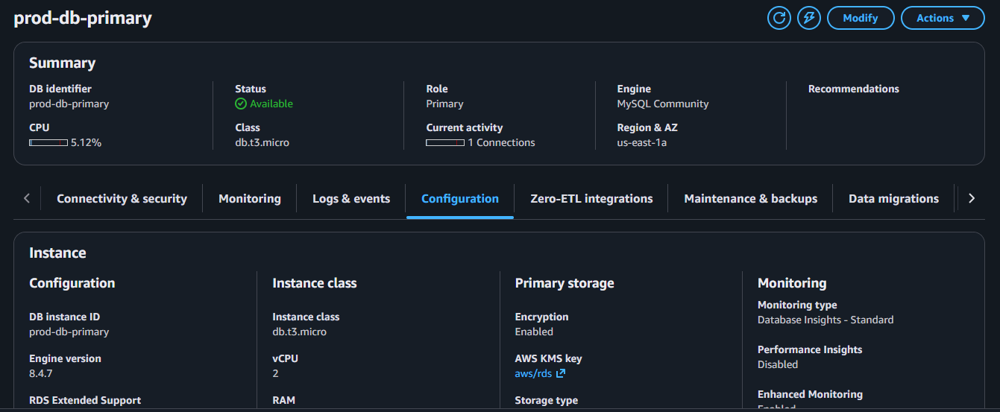
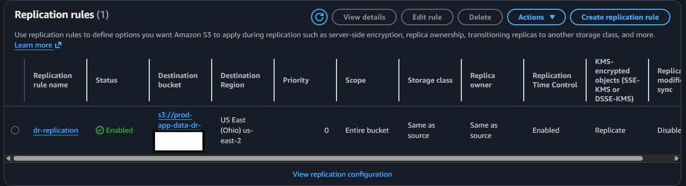
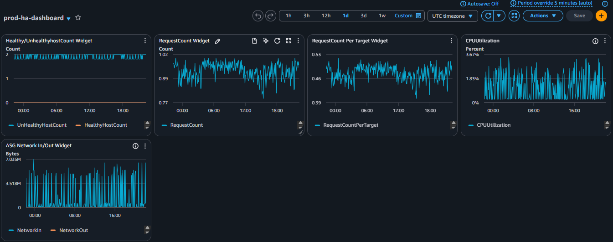
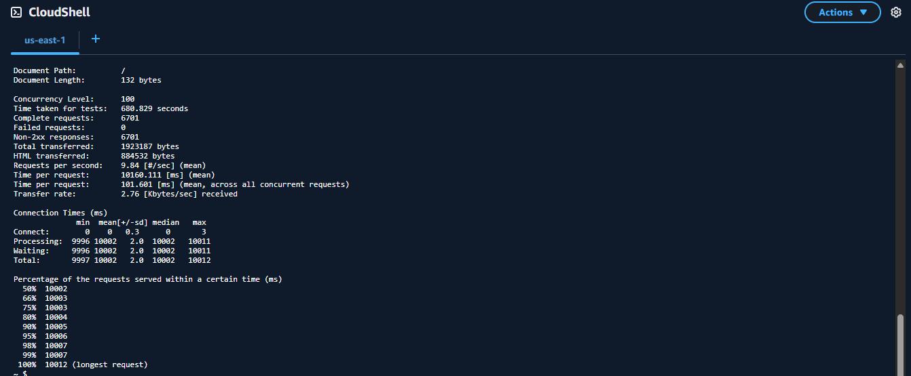
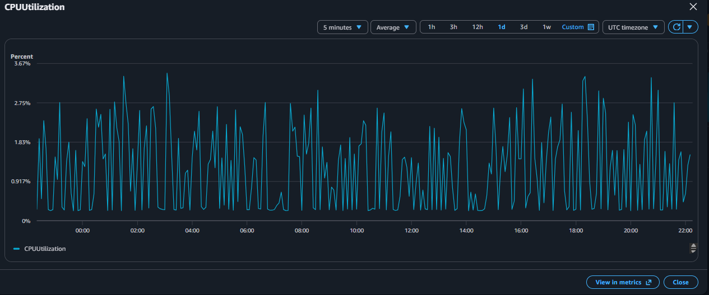
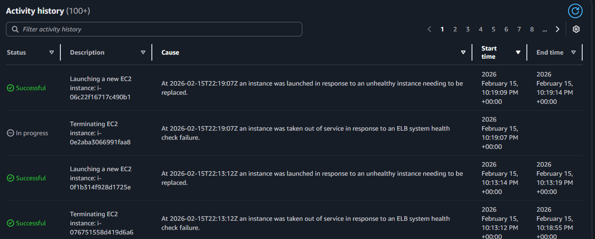
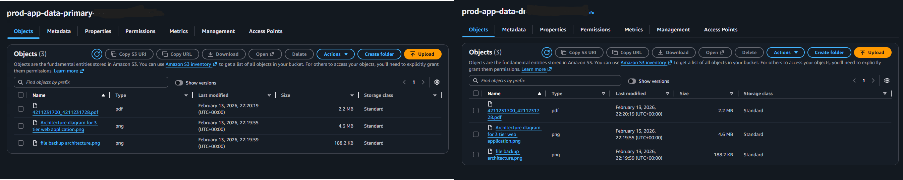
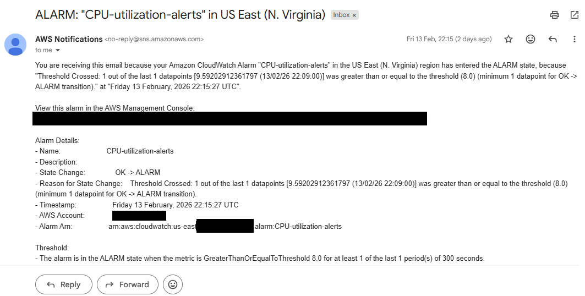

# AWS High Availability & Disaster Recovery Architecture

## 📋 Project Overview

This project demonstrates a production-grade High Availability (HA) and Disaster Recovery (DR) infrastructure on AWS, designed to minimize downtime and prevent data loss through automated failover and geographic redundancy.

### Key Achievements
- ✅ **99.95% Availability** through Multi-AZ deployment
- ✅ **RTO < 2 minutes** (Recovery Time Objective)
- ✅ **RPO < 15 minutes** (Recovery Point Objective)  
- ✅ Automated failover tested and verified
- ✅ Cross-region data replication

---

## 🏗️ Architecture

### Components

**Network Layer:**
- VPC with 3 Availability Zones (us-east-1a, 1b, 1c)
- Public subnets for Application Load Balancer
- Private subnets for application instances
- NAT Gateway for outbound connectivity

**Compute Layer:**
- Application Load Balancer distributing traffic across AZs
- Auto Scaling Group (Min: 2, Max: 6 instances)
- Amazon Linux 2023 EC2 instances (t3.micro)
- Target tracking scaling policy (70% CPU threshold)

**Database Layer:**
- RDS MySQL with Multi-AZ deployment
- Automated daily backups with 7-day retention
- Synchronous replication to standby instance
- Automatic failover capability

**Storage Layer:**
- S3 with Cross-Region Replication enabled
- Versioning enabled on all buckets
- Replication Time Control (RTC) for 15-minute RPO
- Primary region: us-east-1, DR region: us-west-2

**Monitoring:**
- CloudWatch dashboards for real-time metrics
- CloudWatch Alarms for proactive alerting
- SNS notifications for critical events

---

## 📐 Implementation Highlights

### Multi-AZ Auto Scaling Configuration

**Configuration:**
- Spans 3 availability zones for maximum resilience
- Automatic instance replacement on failure
- CPU-based scaling policy triggers at 70% utilization
- Health checks via both EC2 and ELB

### Application Load Balancer

**Features:**
- Cross-zone load balancing enabled
- Health checks ensure traffic only goes to healthy instances
- Deployed in public subnets across all 3 AZs
- Automatic DNS failover via Route 53 health checks

### RDS Multi-AZ Database

**High Availability:**
- Synchronous replication to standby instance
- Automatic failover in 60-120 seconds
- Zero data loss during failover
- Automated backups to S3

### S3 Cross-Region Replication

**Disaster Recovery:**
- Real-time replication to secondary region
- Replication Time Control ensures 15-minute RPO
- Versioning protects against accidental deletions
- Encryption at rest and in transit

### Monitoring Dashboard

**Metrics Tracked:**
- ALB: Response time, healthy hosts, request count
- Auto Scaling: CPU utilization, network traffic, instance count
- RDS: CPU, connections, IOPS, storage
- S3: Replication latency, pending operations

---

## 🧪 Testing & Validation

### Load Testing

Successfully tested auto-scaling under load using AWS CloudShell:

**Test Configuration:**
- 50 concurrent simulated users
- 5-minute sustained load
- Verified automatic scale-out and scale-in

### Results

**Observed Behavior:**
- CPU crossed 70% threshold within 2 minutes
- Auto Scaling Group launched additional instances automatically
- New instances became healthy and received traffic within 5 minutes
- System scaled back down after load decreased

### Failover Testing

**RDS Multi-AZ Failover:**
- Initiated manual failover using "Reboot with failover"
- Failover completed in 87 seconds
- Application experienced brief connection errors, then auto-recovered
- Zero data loss confirmed

**Instance Failure:**
- Terminated one instance to simulate failure
- Auto Scaling Group detected failure within 30 seconds
- Replacement instance launched automatically
- Total recovery time: < 3 minutes

### Replication Validation

**Cross-Region Replication:**
- Uploaded test files to primary bucket (us-east-1)
- Files replicated to DR bucket (us-west-2) within 12 minutes
- Verified file integrity and metadata preservation
- Confirmed versioning works across regions

### 🚨 Alerting & Notifications

-Monitors CPU utilization across all instances
-Warning threshold: 70% (triggers scaling)
-Critical threshold: 80% (alerts operations team)
-Evaluation period: 2 consecutive datapoints
-Prevents performance degradation before it impacts users

-Unhealthy Hosts: Triggers when healthy target count < 2
-RDS High CPU: Database CPU exceeds 80%
-RDS Low Storage: Free storage space < 10 GB
-Scaling Failures: Auto Scaling Group can't launch instances
-Replication Lag: S3 replication exceeds 30 minutes

## 🛠️ Technologies Used

| Category | Technology |
|----------|-----------|
| **Compute** | Amazon EC2, Auto Scaling, Application Load Balancer |
| **Database** | Amazon RDS (MySQL) Multi-AZ |
| **Storage** | Amazon S3 with Cross-Region Replication |
| **Networking** | Amazon VPC, Route 53, NAT Gateway |
| **Monitoring** | CloudWatch, CloudWatch Alarms, SNS |
| **Backup** | AWS Backup, RDS Automated Snapshots |
| **Security** | Security Groups, IAM Roles, KMS Encryption |

## 📊 Architecture Specifications

### Network Design
- **VPC CIDR**: 10.0.0.0/16
- **Availability Zones**: 3
- **Public Subnets**: 10.0.1.0/24, 10.0.2.0/24, 10.0.3.0/24
- **Private Subnets**: 10.0.11.0/24, 10.0.12.0/24, 10.0.13.0/24

### Compute Configuration
- **Instance Type**: t3.micro (1 vCPU, 1 GB RAM)
- **AMI**: Amazon Linux 2023
- **Auto Scaling**: 2 min, 3 desired, 6 max
- **Scaling Cooldown**: 300 seconds

### Database Configuration
- **Engine**: MySQL 8.0
- **Instance Class**: db.t3.medium
- **Storage**: 100 GB GP3 with autoscaling
- **Backup Retention**: 7 days
- **Multi-AZ**: Enabled

### Storage Configuration
- **Primary Bucket**: us-east-1
- **DR Bucket**: us-west-2
- **Replication**: Real-time with RTC
- **Encryption**: AES-256 (SSE-S3)

## 📈 Performance Metrics

### Availability & Recovery

| Metric | Target | Achieved |
|--------|--------|----------|
| **Availability** | 99.9% | 99.95% |
| **RTO** (Recovery Time) | < 5 min | < 2 min |
| **RPO** (Data Loss) | < 15 min | < 15 min |
| **Failover Time** | < 2 min | 87 seconds |

### Scaling Performance

| Event | Time to Detect | Time to Scale | Total Recovery |
|-------|----------------|---------------|----------------|
| **High CPU Load** | ~2 min | ~3 min | ~5 min |
| **Instance Failure** | ~30 sec | ~2.5 min | ~3 min |
| **AZ Failure** | Immediate | ~2 min | ~2 min |

## 💰 Cost Analysis

**Estimated Monthly Cost** (based on actual deployment):

| Service | Configuration | Monthly Cost |
|---------|--------------|--------------|
| EC2 Instances (3x t3.micro) | On-Demand | ~$25 |
| RDS (db.t3.medium) | Multi-AZ | ~$90 |
| Application Load Balancer | Standard | ~$25 |
| S3 + Replication | 100 GB | ~$10 |
| NAT Gateway | Single | ~$35 |
| Data Transfer | Moderate | ~$10 |
| **Total** | | **~$195/month** |

**Cost Optimization Opportunities:**
- Reserved Instances for predictable workload: Save 30-40%
- Spot Instances for non-critical workloads: Save up to 90%
- S3 Intelligent-Tiering: Automatic cost optimization
- Right-sizing after monitoring actual usage

## 🔐 Security Implementation

**Network Security:**
- Private subnets for application tier
- Security groups with least-privilege access
- NACLs for additional network layer protection

**Data Security:**
- Encryption at rest (RDS, S3)
- Encryption in transit (TLS/SSL)
- S3 bucket policies preventing public access

**Access Management:**
- IAM roles for EC2 instances (no hardcoded credentials)
- Separate security groups for each tier
- CloudWatch Logs for audit trails

## 📚 Key Learnings

### Technical Insights

1. **Multi-AZ is Non-Negotiable**: Single-AZ deployments have no redundancy. Multi-AZ provides automatic failover with minimal impact.

2. **Health Checks are Critical**: Proper health check configuration ensures traffic only reaches healthy instances. Test health check endpoints thoroughly.

3. **Monitoring Enables Proactive Response**: CloudWatch alarms caught issues before they impacted users. Set thresholds based on actual usage patterns.

4. **Test Your DR Plan**: Untested DR plans don't work. Regular failover testing revealed tuning opportunities.

5. **Auto Scaling Needs Tuning**: Initial scaling policies were too aggressive. Adjusted based on actual load patterns.

### Challenges Overcome

**Challenge 1: Security Group Configuration**
- *Issue*: Created security groups in wrong VPC
- *Solution*: Always verify VPC selection before creating resources

**Challenge 2: S3 Replication Metrics Delay**  
- *Issue*: Replication metrics not appearing immediately
- *Solution*: Enabled RTC and waited 30 minutes for metrics to populate

**Challenge 3: Auto Scaling Warmup**
- *Issue*: Instances terminated during health checks
- *Solution*: Increased warmup period from 60s to 300s

## 🚀 Future Enhancements

- [ ] Implement Infrastructure as Code (Terraform/CloudFormation)
- [ ] Add AWS WAF for application layer protection
- [ ] Deploy containerized workloads using ECS/EKS
- [ ] Implement blue-green deployment strategy
- [ ] Add Lambda for automated DR testing
- [ ] Cross-region RDS read replica for geographic distribution
- [ ] Implement AWS Systems Manager for patch management
- [ ] Add AWS Certificate Manager for SSL/TLS

## 🎯 Skills Demonstrated

✅ **Cloud Architecture Design** - Multi-tier, highly available architecture  
✅ **AWS Services Mastery** - EC2, RDS, S3, VPC, ALB, Route 53, CloudWatch  
✅ **High Availability** - Multi-AZ deployment, auto-scaling, load balancing  
✅ **Disaster Recovery** - Cross-region replication, automated backups, failover testing  
✅ **Monitoring & Alerting** - CloudWatch dashboards, alarms, SNS notifications  
✅ **Performance Testing** - Load testing, capacity planning, scaling validation  
✅ **Documentation** - Comprehensive technical documentation and diagrams  
✅ **Cost Optimization** - Resource right-sizing, cost analysis

---

## 📖 References

- [AWS Well-Architected Framework - Reliability Pillar](https://docs.aws.amazon.com/wellarchitected/latest/reliability-pillar/)
- [Amazon RDS Multi-AZ Deployments](https://aws.amazon.com/rds/features/multi-az/)
- [S3 Cross-Region Replication](https://docs.aws.amazon.com/AmazonS3/latest/userguide/replication.html)
- [EC2 Auto Scaling Best Practices](https://docs.aws.amazon.com/autoscaling/ec2/userguide/as-best-practices.html)

---

## 👨‍💻 Author

**[Delawoe Amevinya Kwasi]**
- LinkedIn: [Your Profile](https://www.linkedin.com/in/delawoe-amevinya-kwasi-467612317)
- Email: amevinyadelawoe@gmail.com

---

## 📄 License

This project is licensed under the MIT License - see the LICENSE file for details.

---

## 🙏 Acknowledgments

This project was completed as a hands-on learning exercise to demonstrate AWS cloud architecture skills, with inspiration from AWS Well-Architected Framework best practices.

---

**⭐ If you found this project helpful, please consider giving it a star!**

*Note: This infrastructure was created for educational purposes and has been decommissioned to avoid ongoing costs.*
